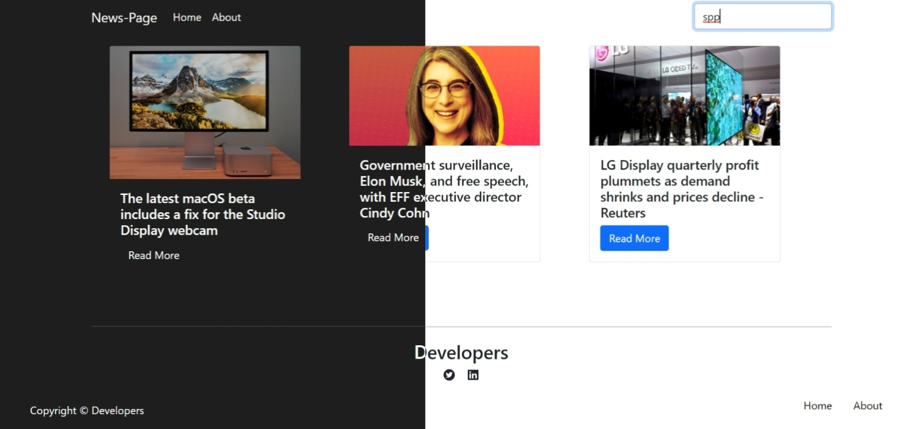

# News Page App

This is a Mini Project with uses a api from [newsapi](https://newsapi.org/) and fetch current news.
Use your api key to run if not just uncomment given line in Home.js.

```javascript
// url = FakeApi;
```

## Requirements

- [React](https://reactjs.org/)
- [NodeJS](https://nodejs.org)

## Installing Dependencies

```bash
npm install
```

## Start the Development Server

```bash
npm start
```

## Build the website

```bash
npm run build
```
## Preview:

